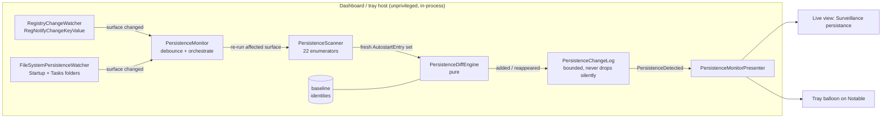

# Phase 3, Guardian: real-time persistence monitoring

Status: **engine implemented and tested; dashboard surfacing wired.** Increments 1–4
below have landed. The pure core, the registry watcher and the filesystem watcher are
covered by unit tests, including real-Windows functional tests that fire
`RegNotifyChangeKeyValue` and `FileSystemWatcher` against private HKCU / temp keys (not
only a VM). The dashboard hosts the monitor and raises a tray balloon on a new startup
item, reusing the app's existing proven `ShowBalloonTip` path. On-start reconciliation
across runs (increment 5) is implemented: the baseline is persisted locally and, on the
next launch, what appeared while WinSight was not running surfaces once. Remaining: a
live end-to-end dashboard smoke test, and ETW/WMI surfaces + writing-process attribution
(increment 6).

## Goal

BlockBlock parity for Windows: tell the operator, in real time, when *something new*
installs itself to run at startup, and hand them the same Authenticode verdict the
on-demand persistence scan already produces. WinSight does not silently remove anything
and, in Phase 3, does not block the write either (see [Limits](#what-this-cannot-do)).

The on-demand scan (`PersistenceScanner`, 22 enumerators) answers *"what persists right
now?"*. Guardian answers *"what just started persisting, and is it worth my attention?"*.

## The one design decision everything else follows

**The 22 enumerators stay the single source of truth. Watchers are only triggers.**

A watcher (registry-change notification, filesystem watcher) is cheap and dumb: it says
*"something under this key/folder changed"*, not *what* changed. On a trigger, Guardian
re-runs the affected enumerator(s), diffs the fresh result against a baseline, and
surfaces the genuinely new entries — resolved and signature-checked by the exact same
code path as the manual scan. We never grow a second, parallel notion of what a
persistence entry is, and we never re-implement `.sdb`/signature logic in a watcher.

This mirrors the firewall split that already works: a thin ETW watcher
(`OutboundConnectionWatcher`) discovers events, and a pure, bounded, well-tested log
(`PendingOutboundLog`) holds the state and the decisions. Guardian is the same shape for
persistence.

## Privilege and process model

Unlike the firewall, **Guardian needs no privileged service and no IPC.** Persistence
*monitoring* is a user-mode, mostly read-only activity:

- Autostart registry keys (Run/RunOnce, Winlogon, Services, …) are readable by a standard
  user; `RegNotifyChangeKeyValue` needs only read access.
- Startup folders and `C:\Windows\System32\Tasks` are readable and `FileSystemWatcher`-able.
- WMI subscription classes are queryable.

So Guardian runs **in-process in the existing (unprivileged) dashboard/tray host**, for as
long as the tray is alive. That is exactly how Objective-See's BlockBlock runs: a
persistent user agent, not a driver. Two consequences are deliberate and stated up front
in [Limits](#what-this-cannot-do): we see *what appeared*, not *who wrote it*, and we cover
"while WinSight is running" in real time plus "what changed since last run" on startup.



## Components

### Pure core (in `WinSight.Persistence`, fully unit-tested)

These have no I/O and carry all the logic. This is where correctness is *proven in CI* —
the standing lesson from the firewall is that anything the unit tests can reach is a bug
caught before the VM, so we push every decision into this layer.

- **`PersistenceIdentity`** — the canonical dedup key for an entry: `(Vector, Name,
  normalized target)`. Normalization reuses the same path-canonicalization idea as
  `OutboundPolicyEvaluator.CanonicalPath` so `C:\X\a.exe` and `c:\x\a.exe` are one identity.
  Two entries with the same identity are "the same persistence", regardless of transient
  command-line noise.
- **`PersistenceDiffEngine`** — pure function: `(baseline: ISet<PersistenceIdentity>,
  fresh: IReadOnlyList<AutostartEntry>) -> (Added, Reappeared, Removed)`. No clock, no I/O,
  fully table-testable.
- **`PersistenceChangeLog`** — the direct analog of `PendingOutboundLog`:
  - bounded at `MaxChanges` (a normal machine adds persistence rarely; a hundred pending
    means something pathological),
  - deduplicates by `PersistenceIdentity`,
  - `Observe(...)` returns `true` only the first time, so callers notify once per entry,
  - refused entries increment `DroppedChanges` — **never a silent truncation**,
  - `Snapshot()` returns most-recent-first.
- **`PersistenceEvent`** — the surfaced record: the `AutostartEntry`, its identity,
  `FirstSeenUtc`/`LastSeenUtc`, and a `kind` (`Added` / `Reappeared`). Severity is *derived*
  from the existing `AutostartEntry.IsSuspicious` / `Status`, not invented here.

### Surface → watch-target map (cohesion with the enumerators)

Each enumerator already knows its own locations (e.g. `RunKeyEnumerator.SubKeys`). We keep
watch knowledge *with the surface* rather than in a separate table, by extending the
interface:

```csharp
public interface IAutostartEnumerator
{
    string Surface { get; }
    IEnumerable<RawAutostart> Enumerate();

    // NEW: what to watch to know this surface may have changed. Empty = not yet watched
    // in real time (still covered by the on-start reconciliation diff). Surfaces opt in
    // incrementally, so a surface without a watcher is honestly "polled on start", never
    // silently unmonitored.
    IReadOnlyList<PersistenceWatchTarget> WatchTargets => [];
}
```

`PersistenceWatchTarget` is a small discriminated shape: either a registry target
`(RegistryHive, RegistryView, subkey, watchSubtree)` or a filesystem target `(path,
includeSubdirectories)`. The monitor builds `watchTarget -> enumerators` from these, so a
trigger re-runs exactly the affected surfaces, nothing more.

### Thin I/O watchers (minimal, VM-validated, not the place for logic)

Kept as small as `OutboundConnectionWatcher`. Each implements
**`IPersistenceChangeSource`** which raises `SurfaceChanged` events; the interface is what
the monitor depends on, so tests drive the monitor with a fake source.

- **`RegistryChangeWatcher`** — `RegNotifyChangeKeyValue` (via CsWin32, consistent with the
  rest of the Win32 surface) with a wait handle per watched key,
  `REG_NOTIFY_CHANGE_LAST_SET | REG_NOTIFY_CHANGE_NAME`, `watchSubtree` where the surface
  needs it (Services). Re-arms after each signal. One background wait loop; cancellation via
  `CancellationToken`.
- **`FileSystemPersistenceWatcher`** — `FileSystemWatcher` over the per-user and common
  Startup folders and `C:\Windows\System32\Tasks` (scheduled tasks are files).
- *(Later increment)* **`EtwPersistenceWatcher`** / a WMI `__InstanceCreationEvent`
  subscription for surfaces with neither a registry nor a file backing.

### Orchestrator: `PersistenceMonitor`

Wires the sources to the core. Responsibilities, all individually testable with a fake
source and a fake/real scanner:

1. **Silent baseline on start** — one full scan seeds the baseline identity set. Pre-existing
   persistence raises *no* alert (the analog of the firewall's "already-ruled" filtering).
   Without this, every machine screams on first launch.
2. **Debounce** — coalesce a burst of triggers (a single installer touches many keys) within
   a short window (~750 ms) before re-scanning, so one install is one pass.
3. **Scoped re-scan** — re-run only the enumerators mapped to the fired watch target.
4. **Diff + record** — `PersistenceDiffEngine` against the baseline; new identities go to
   `PersistenceChangeLog` and update the baseline; raise `PersistenceDetected`.
5. **Graceful degradation** — a surface that can't be watched under the current token
   (e.g. an HKLM key a standard user can't open for notify) is reported as
   *not-watchable*, not silently skipped. Honesty about blind spots is a product rule here.

### Application + Dashboard

- **`PersistenceMonitorPresenter`** (`WinSight.Application`) — mirrors
  `FirewallControlPresenter`: exposes the live change list + counts (`DroppedChanges`,
  not-watchable surfaces) to the UI, marshals nothing itself (UI thread marshalling stays
  in the view).
- **Dashboard** — a "Surveillance persistance" live view, and a **tray balloon** when a
  *Notable* (unsigned / untrusted / file-missing) entry appears; signed-trusted arrivals go
  to the list quietly. All strings localized in `Strings.resx` / `.fr.resx` / `.es.resx`.

## Testability plan (TDD, per repo rules)

- **Pure core** (`PersistenceIdentity`, `PersistenceDiffEngine`, `PersistenceChangeLog`,
  the surface→enumerator mapping, and `PersistenceMonitor` driven by a **fake
  `IPersistenceChangeSource`** and a fake scanner): full unit coverage in
  `WinSight.Persistence.Tests`. Target ≥ 80%, with the diff/baseline/debounce/bounded-log
  invariants pinned by table tests. Behavioural bugs must be catchable here, not only on a VM.
- **Thin watchers** (`RegistryChangeWatcher`, `FileSystemPersistenceWatcher`): source-contract
  tests (assert they arm the right keys/flags) plus **real-machine validation** — the same
  discipline as `docs/ARM64_VALIDATION.md`. A short protocol ("add an HKCU Run value →
  balloon within a second; add a signed one → quiet list entry; flood N values → capped list
  with 'and more not recorded'") ships alongside the code.

## Build increments (each independently shippable and CI-green)

1. **Pure core.** ✅ Done. `PersistenceIdentity`, `PersistenceDiffEngine`,
   `PersistenceChangeLog`, `PersistenceEvent`, the `WatchTargets` interface addition (default
   empty), `PersistenceMonitorCore` (pure orchestration) and the thin `PersistenceMonitor`
   wrapper driven by `IPersistenceChangeSource`. Fully unit-tested.
2. **Registry watcher.** ✅ Done. `RegistryChangeWatcher` (`RegNotifyChangeKeyValue`), initially for
   Run keys, Services, Winlogon and later broadened to the high-value surfaces most abused for
   persistence: IFEO (Image File Execution Options), AppInit_DLLs, Active Setup, SilentProcessExit,
   LSA packages, BootExecute, AppCertDlls, time providers, print monitors/providers, netsh helpers,
   credential providers, browser helper objects, Windows Load/Run — ~17 live surfaces in total. Each
   enumerator just declares its `WatchTargets`; arming the whole default set stays within the WaitAny
   handle cap (asserted by a test). COM/CLSID hijack (a subtree too noisy to watch) and WMI
   subscriptions (no registry/file backing) stay covered by the on-start diff instead. Includes a
   real HKCU functional test that arms the watcher and asserts a value write signals within seconds.
3. **Filesystem watcher.** ✅ Done. `FileSystemPersistenceWatcher` over the Startup folders and
   `\System32\Tasks`, plus `CompositePersistenceChangeSource` fanning registry + filesystem
   into one source. Includes a real temp-folder functional test.
4. **Dashboard + tray.** ✅ Done. `PersistenceMonitorPresenter` (Application) maps detections to
   the shared report model + balloon localization keys; `GuardianHost.CreateDefault()` assembles
   a ready-to-host monitor; the dashboard starts it on load and raises a Notable/Info tray balloon;
   en/fr/es strings added. Live end-to-end smoke test still recommended.
5. **On-start reconciliation.** ✅ Done. `IPersistenceBaselineStore` +
   `FilePersistenceBaselineStore` (local-only `%LocalAppData%\WinSight\guardian-baseline.tsv`,
   atomic write, corrupt-tolerant, bounded) persist the baseline; `PersistenceMonitorCore`
   .`ReconcileFromPersistedBaseline` diffs the current scan against it on Start, so what appeared
   while WinSight was off surfaces once, then the baseline resets to the current state. Wired by
   default through `GuardianHost`.
6. **Later.** ETW/WMI for the remaining surfaces; writing-process attribution (needs
   ETW/audit + elevation — a bonus, not the core value).

## What this cannot do (stated on purpose)

The firewall documents its report-vs-enforce boundary; Guardian documents its detect-vs-block
boundary with the same honesty:

- **It detects and alerts; it does not block the write.** Stopping persistence *as it is
  written* needs a kernel **minifilter** (`FltRegisterFilter`) or a registry-callback driver,
  which needs an EV certificate and attestation signing. Explicitly deferred (Phase 4+), as in
  `ARCHITECTURE.md`.
- **It sees *what* appeared, not *who* wrote it.** A registry-change notification says a key
  changed, not which process changed it. Writing-process attribution needs ETW/audit and
  elevation; deferred.
- **Real-time coverage is "while the tray host runs".** Persistence written while WinSight is
  not running is caught on the next start by the reconciliation diff (implemented, increment 5),
  not in real time.
- **It is bounded and says so.** A flood of new entries is capped at `MaxChanges` with a
  visible "and N more not recorded" — never a silent truncation. A security tool that hides
  its own blind spot is worse than one without the feature.
