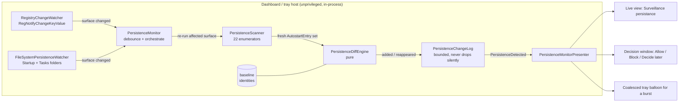

# Phase 3, Guardian: real-time persistence monitoring

Status: **engine implemented and tested; dashboard surfacing wired.** Increments 1–4
below have landed. The pure core, the registry watcher and the filesystem watcher are
covered by unit tests, including real-Windows functional tests that fire
`RegNotifyChangeKeyValue` and `FileSystemWatcher` against private HKCU / temp keys (not
only a VM). The dashboard hosts the monitor and opens a decision window (Allow / Block /
Decide later) on a new startup item, keeping the existing `ShowBalloonTip` path as the fallback for a
burst of arrivals. On-start reconciliation
across runs (increment 5) is implemented: the baseline is persisted locally and, on the
next launch, what appeared while WinSight was not running surfaces once. Remaining: a
live end-to-end dashboard smoke test, and ETW/WMI surfaces + writing-process attribution
(increment 6).

## Goal

BlockBlock parity for Windows: tell the operator, in real time, when *something new*
installs itself to run at startup, and hand them the same Authenticode verdict the
on-demand persistence scan already produces. WinSight does not silently remove anything
and, in Phase 3, does not block the write either (see [Limits](#what-this-cannot-do)).

The on-demand scan (`PersistenceScanner`, 22 enumerators) answers *"what persists right
now?"*. Guardian answers *"what just started persisting, and is it worth my attention?"*.

## The one design decision everything else follows

**The 22 enumerators stay the single source of truth. Watchers are only triggers.**

A watcher (registry-change notification, filesystem watcher) is cheap and dumb: it says
*"something under this key/folder changed"*, not *what* changed. On a trigger, Guardian
re-runs the affected enumerator(s), diffs the fresh result against a baseline, and
surfaces the genuinely new entries - resolved and signature-checked by the exact same
code path as the manual scan. We never grow a second, parallel notion of what a
persistence entry is, and we never re-implement `.sdb`/signature logic in a watcher.

This mirrors the firewall split that already works: a thin ETW watcher
(`OutboundConnectionWatcher`) discovers events, and a pure, bounded, well-tested log
(`PendingOutboundLog`) holds the state and the decisions. Guardian is the same shape for
persistence.

## Privilege and process model

Unlike the firewall, **Guardian needs no privileged service and no IPC.** Persistence
*monitoring* is a user-mode, mostly read-only activity:

- Autostart registry keys (Run/RunOnce, Winlogon, Services, …) are readable by a standard
  user; `RegNotifyChangeKeyValue` needs only read access.
- Startup folders and `C:\Windows\System32\Tasks` are readable and `FileSystemWatcher`-able.
- WMI subscription classes are queryable.

So Guardian runs **in-process in the existing (unprivileged) dashboard/tray host**, for as
long as the tray is alive. That is exactly how Objective-See's BlockBlock runs: a
persistent user agent, not a driver. Two consequences are deliberate and stated up front
in [Limits](#what-this-cannot-do): we see *what appeared*, not *who wrote it*, and we cover
"while WinSight is running" in real time plus "what changed since last run" on startup.


```mermaid
flowchart LR
    subgraph host["Dashboard / tray host (unprivileged, in-process)"]
        RW[RegistryChangeWatcher<br/>RegNotifyChangeKeyValue] -->|surface changed| MON
        FW[FileSystemPersistenceWatcher<br/>Startup + Tasks folders] -->|surface changed| MON
        MON[PersistenceMonitor<br/>debounce + orchestrate]
        MON -->|re-run affected surface| SCAN[PersistenceScanner<br/>22 enumerators]
        SCAN -->|fresh AutostartEntry set| DIFF[PersistenceDiffEngine<br/>pure]
        BASE[(baseline<br/>identities)] --- DIFF
        DIFF -->|added / reappeared| LOG[PersistenceChangeLog<br/>bounded, never drops silently]
        LOG -->|PersistenceDetected| PRES[PersistenceMonitorPresenter]
    end
    PRES --> VIEW[Live view: Surveillance persistance]
    PRES --> WIN[Decision window: Allow / Block / Decide later]
    PRES --> TRAY[Coalesced tray balloon for a burst]
```

## Components

### Pure core (in `WinSight.Persistence`, fully unit-tested)

These have no I/O and carry the reconciliation logic. Unit tests exercise the modeled scenarios;
live Windows acquisition and notification behavior still require VM qualification.

- **`PersistenceIdentity`** - the dedup key includes the enumerator source, vector, entry name,
  source location, normalized executable target and argument payload. Executable path spelling
  can be normalized, but argument case, quoted spaces and encoded data are preserved. Moving an
  entry from Run to RunOnce, or changing a case-sensitive function argument, is a new identity.
- **`PersistenceDiffEngine`** - pure function: `(baseline: ISet<PersistenceIdentity>,
  fresh: IReadOnlyList<AutostartEntry>) -> (Added, Removed)`. The monitor applies removals only to
  completely read sources and uses that updated state to recognize a later arrival. No clock or I/O
  is needed for the comparison.
- **`PersistenceChangeLog`** - the direct analog of `PendingOutboundLog`:
  - bounded at `MaxChanges` (a normal machine adds persistence rarely; a hundred pending
    means something pathological),
  - deduplicates by `PersistenceIdentity`,
  - ordinary repeated observations are deduplicated; a confirmed disappearance followed by a
    new arrival can notify again even if the previous journal entry is still pending,
  - refused entries increment `DroppedChanges` - **never a silent truncation**,
  - `Snapshot()` returns most-recent-first.
- **`PersistenceEvent`** - the surfaced record: the `AutostartEntry`, its identity,
  `FirstSeenUtc`/`LastSeenUtc`, and an observation count. Severity is *derived*
  from the existing `AutostartEntry.IsSuspicious` / `Status`, not invented here.

### Surface → watch-target map (cohesion with the enumerators)

Each enumerator already knows its own locations (e.g. `RunKeyEnumerator.SubKeys`). We keep
watch knowledge *with the surface* rather than in a separate table, by extending the
interface:

```csharp
public interface IAutostartEnumerator
{
    string Surface { get; }
    IEnumerable<RawAutostart> Enumerate();

    // NEW: what to watch to know this surface may have changed. Empty = not yet watched
    // in real time (still covered by the on-start reconciliation diff). Surfaces opt in
    // incrementally, so a surface without a watcher is honestly "polled on start", never
    // silently unmonitored.
    IReadOnlyList<PersistenceWatchTarget> WatchTargets => [];
}
```

`PersistenceWatchTarget` is a small discriminated shape: either a registry target
`(RegistryHive, RegistryView, subkey, watchSubtree)` or a filesystem target `(path,
includeSubdirectories)`. The monitor builds `watchTarget -> enumerators` from these, so a
trigger re-runs exactly the affected surfaces, nothing more.

### Thin I/O watchers (minimal, VM-validated, not the place for logic)

Kept as small as `OutboundConnectionWatcher`. Each implements
**`IPersistenceChangeSource`** which raises `SurfaceChanged` events; the interface is what
the monitor depends on, so tests drive the monitor with a fake source.

- **`RegistryChangeWatcher`** - `RegNotifyChangeKeyValue` (a hand-written `LibraryImport`,
  consistent with the rest of the Win32 surface) with a wait handle per watched key,
  `REG_NOTIFY_CHANGE_LAST_SET | REG_NOTIFY_CHANGE_NAME`, `watchSubtree` where the surface
  needs it (Services). Re-arms after each signal. One background wait loop; cancellation via
  `CancellationToken`.
- **`FileSystemPersistenceWatcher`** - `FileSystemWatcher` over the per-user and common
  Startup folders and `C:\Windows\System32\Tasks` (scheduled tasks are files).
- *(Later increment)* **`EtwPersistenceWatcher`** / a WMI `__InstanceCreationEvent`
  subscription for surfaces with neither a registry nor a file backing.

### Orchestrator: `PersistenceMonitor`

Wires the sources to the core. Responsibilities, all individually testable with a fake
source and a fake/real scanner:

1. **Silent baseline on start** - one full scan seeds the baseline identity set. Pre-existing
   persistence raises *no* alert (the analog of the firewall's "already-ruled" filtering).
   Without this, every machine screams on first launch.
2. **Debounce** - coalesce a burst of triggers (a single installer touches many keys) within
   a short window (~750 ms) before re-scanning, so one install is one pass.
3. **Scoped re-scan** - re-run only the enumerators mapped to the fired watch target.
4. **Diff + record** - `PersistenceDiffEngine` against the baseline; new identities go to
   `PersistenceChangeLog` and update the baseline; raise `PersistenceDetected`.
5. **Graceful degradation** - a surface that can't be watched under the current token
   (e.g. an HKLM key a standard user can't open for notify) is reported as
   *not-watchable*, not silently skipped. Honesty about blind spots is a product rule here.
6. **Absence needs evidence** - a source may remove identities only after a read in which every
   skipped item was counted. Denied scheduled-task folders or definitions, and denied COM class
   registrations behind credential providers, BHOs and task COM handlers, are counted as
   unreadable locations; a denied class no longer aborts the rest of its surface.
7. **Delivery before acknowledgement** - notifications run outside every lock `Dispose` waits on.
   An arrival is excluded from each saved baseline until every `Detected` handler has returned for
   it, so a subscriber failure, shutdown or crash before delivery re-reports it on the next launch
   (at-least-once; a crash after delivery can repeat it).
9. **Failure boundary** - scans, saves and notifications run on timer threads, where an unhandled
   exception ends the process. Non-catastrophic failures (anything but out-of-memory, stack
   exhaustion or access violations) are contained and recorded in `PersistenceMonitor.Diagnostics`
   (counts, last exception, pending notifications). A failing handler is retried for that handler
   only, at most four attempts per arrival; failed scans are requeued for the same surfaces; retries
   back off (2 s, 10 s, 60 s) and then stop until a new change signal, `RetryNow`, or the next launch.
   The dashboard shows a degraded Guardian as partial and journals each new fault once. The baseline
   store now throws on write failure instead of silently skipping persistence.
10. **Bounded shutdown** - `Dispose` cancels acquisition and waits 300 ms for the scan in progress.
   Registry reads, Task Scheduler COM calls and in-flight WinVerifyTrust calls do not observe
   cancellation (the scanner checks it between surfaces and files; WMI queries now time out after
   30 s). If the scan does not leave in time, its own thread disposes the change source and saves
   the final baseline as it exits, so resources in use are not released early and the UI thread is
   not held. If the process ends first, the last baseline saved during monitoring remains.
11. **Scoped absence** - an enumerator may attribute each unreadable read to a location prefix
   (`UnreadableScopes`). Removals are then confirmed for identities outside those prefixes, so a
   remove-and-reinstall in the readable part of another user's hive, the services key, task folders
   or IFEO is re-alerted. Any unattributed failure keeps the whole-source rule. On the unelevated
   development machine all four routinely incomplete sources became scoped; a denied IFEO key
   (`DefenderAgentScan.exe`) previously aborted the whole IFEO enumeration in both registry views.
   A removal and reinstallation that both happen between two observations remain undetectable.
12. **Notification independent of the display list** - the change log keeps at most 256 arrivals for
   display and nothing acknowledges them. Arrivals beyond that used to enter the baseline without any
   notification for the rest of the session; they are now reported, and the unlisted count appears in
   the diagnostics tooltip. When automatic retries have stopped, the tray menu offers "Retry Guardian".
8. **Visible start failure** - the dashboard reports a Guardian start that failed as `Failed`, not
   `Off`, and polls monitor health so later coverage loss is not frozen behind an earlier state.
13. **Watcher threads** - the registry watcher's wait loop and the file-system watcher's callbacks
   contain subscriber faults (counted) instead of ending the process. Registry keys and filesystem
   directories that cannot currently be armed remain explicit unarmed targets and are retried every
   30 seconds; a successful recovery forces a scoped reconciliation because the blind interval cannot
   be replayed. Overflow/re-arm failures, OS observations, recovery attempts/successes and delivery
   failures flow through the shared `SensorHealthSnapshot` into the dashboard tooltip. Historical
   loss remains a partial state after recovery. The dashboard's handler writes the alert journal first
   and fails the notification when that write fails, so the arrival stays unacknowledged and is retried.

### Response (operator-confirmed, reversible)

A new arrival opens a decision window in the dashboard (`AlertWindow`) offering Allow, Block or Decide
later; "Decide later" is the default and the cancel action, so no keystroke removes an item. A burst of
arrivals keeps the coalesced balloon, and at most three decision windows are open at once, beyond which
the balloon is the fallback. The decisions are made by `GuardianAlertPresenter` (`WinSight.Application`)
over `PersistenceResponder` and the `WinSight.Response` engine, never automatically, and all of them are
journalled:

- **Allow** stores a rule that silences the item. It silences the interruption, not the evidence: an
  allowed arrival is still journalled as "not announced", naming the rule, because the rule store is
  writable by any software running as the user. `winsight rules` lists rules; `winsight revoke <id>
  --confirm` removes one.
- **Block** is available for the two user-privilege vectors below; the confirmation shows the
  `winsight restore <id> --confirm` that undoes it.

The vectors Block covers:

- **HKCU Run/RunOnce values** and **the current user's Startup-folder files**. `PersistenceActionResolver`
  turns an `AutostartEntry` into a structured target only for these; every other vector is offered Allow
  only until the privileged response command family ships (no guessing at a target).
- **Block** = revalidate the entry against the alert (the value's data, or the file path), quarantine
  it (the registry value with its kind preserved, or the file's bytes) and remove it. A value or file
  that changed since the alert is refused.
- **Restore** writes the quarantined item back, but only when the origin is still free - a name now
  occupied by something else is left untouched.
- Because a Block removes the entry, the next scan reconciles a confirmed removal and raises no alert
  for WinSight's own action; a later reinstallation alerts again unless an Allow rule (the per-user
  `RuleStore`) covers it.

## Application + Dashboard

- **`PersistenceMonitorPresenter`** (`WinSight.Application`) - mirrors
  `FirewallControlPresenter`: exposes the live change list + counts (`DroppedChanges`,
  not-watchable surfaces) to the UI, marshals nothing itself (UI thread marshalling stays
  in the view).
- **Dashboard** - a "Surveillance persistance" live view, and a **tray balloon** when a
  *Notable* (unsigned / untrusted / file-missing) entry appears; signed-trusted arrivals go
  to the list quietly. All strings localized in `Strings.resx` / `.fr.resx` / `.es.resx`.

## Testability plan (TDD, per repo rules)

- **Pure core** (`PersistenceIdentity`, `PersistenceDiffEngine`, `PersistenceChangeLog`,
  the surface→enumerator mapping, and `PersistenceMonitor` driven by a **fake
  `IPersistenceChangeSource`** and a fake scanner): full unit coverage in
  `WinSight.Persistence.Tests`. Target ≥ 80%, with the diff/baseline/debounce/bounded-log
  invariants pinned by table tests. Behavioural bugs must be catchable here, not only on a VM.
- **Thin watchers** (`RegistryChangeWatcher`, `FileSystemPersistenceWatcher`): source-contract
  tests (assert they arm the right keys/flags) plus **real-machine validation** - the same
  discipline as `docs/ARM64_VALIDATION.md`. A short protocol ("add an HKCU Run value →
  balloon within a second; add a signed one → quiet list entry; flood N values → capped list
  with 'and more not recorded'") ships alongside the code.

## Build increments (each independently shippable and CI-green)

1. **Pure core.** ✅ Done. `PersistenceIdentity`, `PersistenceDiffEngine`,
   `PersistenceChangeLog`, `PersistenceEvent`, the `WatchTargets` interface addition (default
   empty), `PersistenceMonitorCore` (pure orchestration) and the thin `PersistenceMonitor`
   wrapper driven by `IPersistenceChangeSource`. Fully unit-tested.
2. **Registry watcher.** ✅ Done. `RegistryChangeWatcher` (`RegNotifyChangeKeyValue`), initially for
   Run keys, Services, Winlogon and later broadened to the high-value surfaces most abused for
   persistence: IFEO (Image File Execution Options), AppInit_DLLs, Active Setup, SilentProcessExit,
   LSA packages, BootExecute, AppCertDlls, time providers, print monitors/providers, netsh helpers,
   credential providers, browser helper objects, Windows Load/Run - ~17 live surfaces in total. Each
   enumerator just declares its `WatchTargets`; arming the whole default set stays within the WaitAny
   handle cap (asserted by a test). COM/CLSID hijack (a subtree too noisy to watch) and WMI
   subscriptions (no registry/file backing) stay covered by the on-start diff instead. Includes a
   real HKCU functional test that arms the watcher and asserts a value write signals within seconds.
3. **Filesystem watcher.** ✅ Done. `FileSystemPersistenceWatcher` over the Startup folders and
   `\System32\Tasks`, plus `CompositePersistenceChangeSource` fanning registry + filesystem
   into one source. Includes a real temp-folder functional test.
4. **Dashboard + tray.** ✅ Done. `PersistenceMonitorPresenter` (Application) maps detections to
   the shared report model + balloon localization keys; `GuardianHost.CreateDefault()` assembles
   a ready-to-host monitor; the dashboard starts it on load and raises a Notable/Info tray balloon;
   en/fr/es strings added. Live end-to-end smoke test still recommended.
5. **On-start reconciliation.** ✅ Done. `IPersistenceBaselineStore` +
   `FilePersistenceBaselineStore` (local-only `%LocalAppData%\WinSight\guardian-baseline.tsv`,
   atomic write, corrupt-tolerant, bounded) persist the baseline; `PersistenceMonitorCore`
   .`ReconcileFromPersistedBaseline` diffs the current scan against it on Start, so what appeared
   while WinSight was off surfaces once. The baseline replaces only sources whose absence can be
   confirmed; unscanned or incompletely read sources retain previous identities. Version 3 stores
   source, location and lossless encoded arguments. Older baselines cannot recover that information
   and are reseeded silently once on upgrade, so that first launch cannot reconstruct offline
   changes against the older baseline. Wired by default through `GuardianHost`.
6. **Scoped re-scan.** ✅ Done. A change re-scans only the surface that fired - the change source
   carries the fired `PersistenceWatchTarget`, and the monitor maps it to the owning enumerator(s)
   via `WatchTargets` and scans just those (full scan when the origin is unknown). Real-machine
   latency for a new HKCU Run value dropped from ~20s to ~0.5s.
7. **Deferred - needs elevation.** Live WMI/ETW surfaces and writing-process attribution both
   require admin (reading `root\subscription`, the kernel-registry ETW provider, or the security
   audit log), which would break the unprivileged in-dashboard model. A future opt-in elevated
   "deep monitoring" mode could add them; the WMI subscription surface stays covered by the on-start
   reconciliation diff meanwhile.

## What this cannot do (stated on purpose)

The firewall documents its report-vs-enforce boundary; Guardian documents its detect-vs-block
boundary with the same honesty:

- **It detects and alerts; it does not block or remove the persistence.** A prevention or removal
  workflow needs a separate implementation and safety qualification.
- **Writing-process attribution is conditional.** Registry notifications do not identify the
  writer. The optional elevated ETW attribution path can supply that context when a matching
  observation exists; otherwise the alert reports the attribution gap.
- **Real-time coverage is "while the tray host runs".** Persistence written while WinSight is
  not running is caught on the next start by the reconciliation diff (implemented, increment 5),
  not in real time.
- **It is bounded and says so.** A flood of new entries is capped at `MaxChanges` with a
  visible "and N more not recorded" - never a silent truncation. A security tool that hides
  its own blind spot is worse than one without the feature.
- **The balloon is not the only record.** Windows can suppress tray balloons outright (Focus
  Assist, including its automatic full-screen rule) and throttles an app that
  posts several toasts quickly - both indistinguishable from "nothing was detected". Every
  detection is therefore also appended to a local, bounded alert journal
  (`%LocalAppData%\WinSight\alerts.log`, see `AlertJournal`) *before* the balloon is raised, so a
  missed or suppressed alert still leaves a trace to come back to. Fields, entries and file size
  are bounded; malformed/unreadable input is reported, and an oversized journal is preserved aside
  before a fresh one is created.
